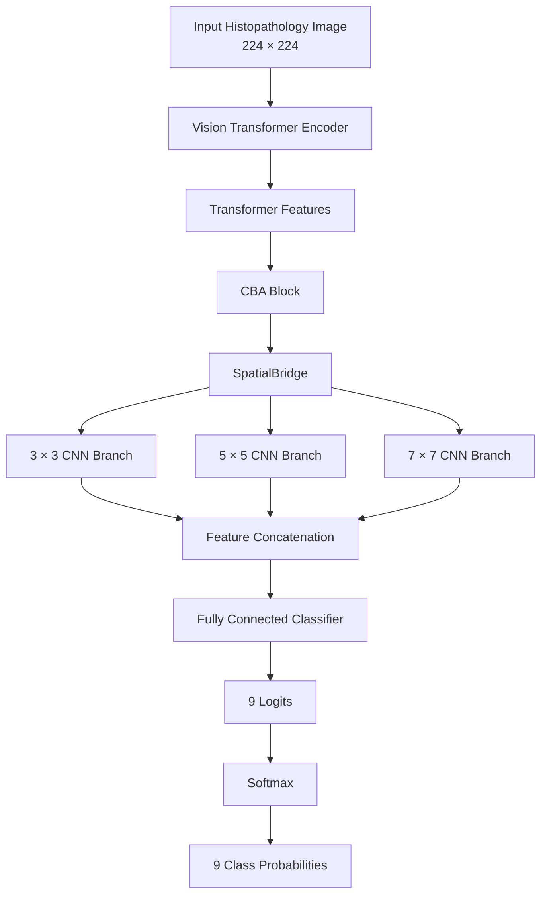
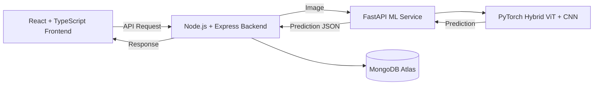
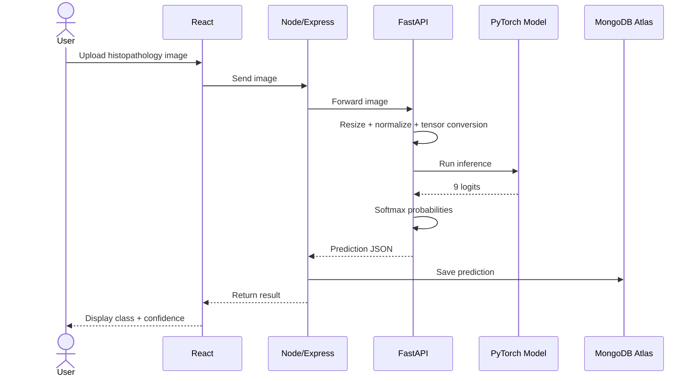

# 🧬 Patho
### AI-Assisted Multiclass Histopathology Classification using Hybrid ViT + CNN

**Patho** is an end-to-end AI-assisted histopathology analysis platform that classifies tissue images into **9 cancer-related classes** using a hybrid **Vision Transformer (ViT) + Convolutional Neural Network (CNN)** architecture.

The trained PyTorch model is integrated into a complete application using **FastAPI, Node.js, Express, MongoDB Atlas, React, TypeScript, and Vite**.

> ⚠️ **Disclaimer:** Patho is an academic and research project. It is not a certified medical device and should not be used as a replacement for professional medical diagnosis.

---

## ✨ Project Motivation

Manual examination of histopathological images requires significant expertise and can be time-consuming.

Patho explores how artificial intelligence can assist this workflow by automatically identifying patterns in histopathology images and predicting the most likely tissue/cancer class.

The central idea behind the project is:

> **Combine the global understanding of a Vision Transformer with the local feature-extraction ability of CNNs.**

---

# 🚀 Key Features

- 🧠 Hybrid **Vision Transformer + CNN** architecture
- 🔬 Multiclass histopathology image classification
- 🎯 **9 output classes**
- 📊 Prediction confidence and class probabilities
- 👨‍⚕️ Patient management
- 📁 Case management
- 🧪 AI-assisted diagnosis workflow
- 📄 Diagnostic report generation
- ☁️ MongoDB Atlas persistence
- ⚡ FastAPI-based ML inference service
- 🌐 React + TypeScript frontend
- 🔗 Node.js + Express application backend
- 🧩 Modular frontend/backend/ML architecture

---

# 🧠 Problem Type

Patho performs:

> **Supervised Multiclass Image Classification**

### Why supervised?

Every training image has a known class label.

```text
Histopathology Image → Known Class Label
```

### Why multiclass?

The model predicts one class from **9 possible classes**.

---

# 🏷️ Output Classes

| Index | Class |
|------:|-------|
| 0 | `breast_cancer` |
| 1 | `breast_normal` |
| 2 | `colon_cancer` |
| 3 | `colon_normal` |
| 4 | `lung_normal` |
| 5 | `lung_type1_cancer` |
| 6 | `lung_type2_cancer` |
| 7 | `oral_cancer` |
| 8 | `oral_normal` |

> The class order must remain identical between the ML service and backend.

---

# 📚 Dataset Sources

The project combines histopathology images from multiple sources:

- **LC25000**
  - Lung
  - Colon

- **BreakHis**
  - Breast histopathology

- **Oral Histopathology Dataset**
  - Oral tissue images

Combining datasets allows the model to solve a broader multiclass problem instead of only classifying one organ.

---

# ⚠️ Dataset Challenges

Different datasets may contain variations in:

- staining
- microscope/scanner
- magnification
- resolution
- color distribution
- image acquisition conditions

These differences can create **domain shift**, so preprocessing and proper dataset splitting are important.

---

# 🧠 Why Hybrid ViT + CNN?

Histopathology images contain both:

- **small local cellular details**
- **larger tissue-level relationships**

CNN and ViT are good at different things.

### CNN

CNN captures **local features**, such as:

- cell structure
- tissue texture
- edges
- shapes
- local abnormalities

### Vision Transformer

ViT captures **global relationships** between different image regions using self-attention.

### Hybrid intuition

```text
CNN
↓
Local cellular information

ViT
↓
Global patch relationships

CNN + ViT
↓
Richer feature representation
↓
Cancer classification
```

---

# 🏗️ Model Architecture



---

# 🔍 Architecture Explanation

## 1. Vision Transformer Encoder

The ViT encoder captures **global relationships** in the histopathology image.

Instead of processing only nearby pixels, it can model relationships between distant image regions.

---

## 2. Image Patches

The image is resized to:

```text
224 × 224
```

For a ViT-B/16 style encoder:

```text
Patch size = 16 × 16
```

Therefore:

```text
224 / 16 = 14
14 × 14 = 196 patches
```

The complete image is represented as a sequence of patches.

---

## 3. Patch Embedding

Each patch is converted into a numerical vector called an **embedding**.

```text
Image Patch
↓
Flatten
↓
Linear Projection
↓
Patch Embedding
```

---

## 4. Positional Embedding

Transformers do not naturally know where each patch came from.

Positional embeddings provide information about the location of each patch.

---

# 🎯 Self-Attention

Self-attention allows one image patch to understand its relationship with other patches.

Simple interpretation:

```text
Query = What am I looking for?

Key = What information is available?

Value = What information should be passed?
```

Conceptually:

```text
Attention(Q, K, V)
=
softmax(QKᵀ / √d) V
```

This allows ViT to capture long-range relationships across the image.

---

# 🔬 CNN Feature Extraction

CNNs use filters that move across spatial feature maps.

Earlier CNN layers may learn:

- edges
- boundaries
- texture

Deeper layers can learn:

- tissue structures
- cellular patterns
- abnormal morphology

---

# 📐 Multi-Scale CNN

The model uses multiple CNN kernel sizes:

```text
3 × 3
5 × 5
7 × 7
```

This allows the model to capture patterns at different spatial scales.

```text
Small kernel
→ fine local details

Large kernel
→ wider local context
```

---

# 🌉 SpatialBridge

Transformer outputs are naturally represented as patch sequences.

CNNs work with spatial feature maps.

The **SpatialBridge** converts/reorganizes transformer features into a spatial format suitable for CNN processing.

```text
Transformer Features
↓
SpatialBridge
↓
CNN-Compatible Representation
```

---

# 🔗 Feature Concatenation

Features learned at different scales are combined before final classification.

```text
Global ViT Features
+
Local CNN Features
↓
Combined Representation
↓
Classifier
```

---

# 🎯 Final Classification

The classifier generates:

```text
9 logits
```

One for every class.

```text
Model
↓
Logits
↓
Softmax
↓
Probabilities
↓
Highest probability
↓
Predicted class
```

---

# 🖼️ Image Preprocessing

Before inference:

```text
Input Image
↓
Resize to 224 × 224
↓
Convert to Tensor
↓
ImageNet Normalization
↓
Model Inference
```

---

## Why 224 × 224?

- fixed model input size
- allows batching
- compatible with pretrained vision models
- keeps computation manageable

---

## Why ImageNet Normalization?

The pretrained vision encoder expects input statistics similar to ImageNet.

Using the same normalization improves compatibility with pretrained weights.

---

# 🔄 Training Pipeline

```text
Training Image
↓
Preprocessing
↓
Forward Pass
↓
Prediction
↓
Calculate Loss
↓
Backpropagation
↓
Calculate Gradients
↓
Optimizer Updates Weights
↓
Repeat
```

---

# 📉 Loss Function

For multiclass classification, the project uses:

> **Cross-Entropy Loss**

The model predicts one class among nine possible classes.

Cross-entropy compares the predicted class scores with the true class.

---

# ⚙️ Learning Rate

The learning rate controls how much the model weights change during each update.

```text
new_weight
=
old_weight
-
learning_rate × gradient
```

### Too high

- unstable training
- may overshoot the optimum

### Too low

- training becomes very slow

---

# 🧠 Overfitting

Overfitting happens when a model performs very well on training data but poorly on unseen data.

Example:

```text
Training Accuracy   → 99%
Validation Accuracy → 80%
```

Ways to reduce overfitting:

- data augmentation
- dropout
- L2 regularization
- early stopping
- more diverse data
- controlling model complexity

---

# 🔄 Data Augmentation

Training images can be transformed using:

- rotations
- flipping
- cropping
- brightness changes
- color changes

Purpose:

> Increase training diversity and improve generalization.

Random augmentation is mainly used during training.

---

# 📊 Evaluation Metrics

The model achieved approximately:

| Metric | Score |
|-------|------:|
| Accuracy | **96.21%** |
| Precision | **96.48%** |
| Recall | **96.31%** |
| F1 Score | **96.28%** |

> These are experimental research results and not clinical-performance claims.

---

# 🎯 Accuracy

Accuracy measures:

```text
Correct Predictions
--------------------
Total Predictions
```

However, accuracy alone may not be enough for medical classification.

---

# 🎯 Precision

Precision answers:

> Out of everything predicted as positive, how many were actually positive?

```text
Precision = TP / (TP + FP)
```

---

# 🎯 Recall

Recall answers:

> Out of all actual positive cases, how many did the model detect?

```text
Recall = TP / (TP + FN)
```

Recall is important when missing an actual cancer case is costly.

---

# 🎯 F1 Score

F1 balances precision and recall.

```text
F1 =
2 × Precision × Recall
-----------------------
Precision + Recall
```

---

# 📊 Confusion Matrix

A confusion matrix compares:

```text
Actual Class
vs
Predicted Class
```

It helps identify:

- false positives
- false negatives
- classes frequently confused with each other

For example:

```text
oral_cancer
↓ incorrectly predicted as
oral_normal
```

This information is not visible from accuracy alone.

---

# 🌐 Full-Stack Architecture



---

# 🔄 End-to-End Prediction Flow



---

# ⚡ What Happens When an Image Is Uploaded?

```text
1. User uploads image from React

2. React sends image to Node/Express

3. Backend validates image

4. Node forwards image to FastAPI

5. FastAPI preprocesses image

6. PyTorch model performs inference

7. Model produces 9 logits

8. Softmax converts logits to probabilities

9. Highest probability becomes predicted class

10. FastAPI sends result to Node

11. Node stores prediction in MongoDB

12. React displays result
```

---

# 🧩 Why Node + FastAPI?

The project separates responsibilities.

### Node.js / Express

Handles:

- patients
- cases
- reports
- application APIs
- MongoDB
- business logic

### FastAPI

Handles:

- image preprocessing
- PyTorch inference
- model loading
- prediction generation

```text
Node
=
Application Backend

FastAPI
=
Machine Learning Backend
```

This makes the architecture modular and easier to maintain.

---

# 🗄️ MongoDB Atlas

MongoDB stores persistent application data such as:

```text
Patients
Cases
Predictions
Reports
```

This means application data remains available even after browser refresh or server restart.

---

# 💾 Why MongoDB Instead of localStorage?

`localStorage` only stores data inside one browser.

MongoDB provides:

- persistent storage
- backend-managed data
- structured records
- multi-device availability
- easier querying
- better application architecture

Therefore patient, case, prediction, and report data are stored in MongoDB.

---

# 🧰 Technology Stack

## Frontend

- React
- TypeScript
- Vite
- Tailwind CSS
- React Router
- Lucide Icons

## Backend

- Node.js
- Express.js
- TypeScript
- Mongoose

## Machine Learning

- Python
- PyTorch
- FastAPI
- Vision Transformer
- Convolutional Neural Networks

## Database

- MongoDB Atlas

---

# 📁 Project Structure

```text
Patho/
│
├── client/
│   ├── src/
│   │   ├── components/
│   │   ├── pages/
│   │   ├── services/
│   │   ├── context/
│   │   ├── config/
│   │   ├── types/
│   │   └── utils/
│   │
│   ├── package.json
│   └── vite.config.*
│
├── server/
│   ├── src/
│   │   ├── controllers/
│   │   ├── models/
│   │   ├── routes/
│   │   ├── services/
│   │   └── utils/
│   │
│   └── package.json
│
├── ml-service/
│   ├── app/
│   │   ├── main.py
│   │   └── model_integration.py
│   │
│   ├── models/
│   │   └── patho_stage2_best.pth
│   │
│   └── requirements.txt
│
└── README.md
```

---

# ⚙️ Environment Variables

## Backend

Create:

```text
server/.env
```

Example:

```env
PORT=5000

MONGODB_URI=your_mongodb_atlas_connection_string

ML_SERVICE_URL=http://127.0.0.1:8000
```

---

## ML Service

Create:

```text
ml-service/.env
```

Example:

```env
MODEL_PATH=./models/patho_stage2_best.pth
```

> Never upload real database credentials or secrets to GitHub.

---

# ▶️ Running the Project

The application uses **three processes**.

---

## 1️⃣ Start ML Service

```powershell
cd ml-service

python -m venv venv

.\venv\Scripts\Activate.ps1

pip install -r requirements.txt

python -m uvicorn app.main:app --reload --host 127.0.0.1 --port 8000
```

Expected:

```text
Model loaded

Application startup complete

Uvicorn running on http://127.0.0.1:8000
```

---

## 2️⃣ Start Backend

```powershell
cd server

npm install

npm run dev
```

Expected:

```text
MongoDB connected

Patho backend listening on port 5000
```

---

## 3️⃣ Start Frontend

```powershell
cd client

npm install

npm run dev
```

Typical URL:

```text
http://localhost:5173
```

---

# 📦 Production Build

## Frontend

```powershell
cd client

npm run build
```

Output:

```text
client/dist/
```

---

## Backend

```powershell
cd server

npm run build
```

This verifies the TypeScript backend before production deployment.

---

# 🧠 ML Inference

During prediction:

```text
Image
↓
Resize
↓
Normalize
↓
Tensor
↓
model.eval()
↓
torch.no_grad()
↓
Forward Pass
↓
Logits
↓
Softmax
↓
Class Probabilities
```

---

# 🧪 Why `model.eval()`?

`model.eval()` puts the neural network into evaluation mode.

It ensures layers such as:

- dropout
- batch normalization

behave correctly during inference.

---

# ⚡ Why `torch.no_grad()`?

During prediction, gradients are not required.

Using:

```python
torch.no_grad()
```

reduces:

- memory usage
- unnecessary computation

and makes inference more efficient.

---

# 🧠 Logits vs Probabilities

The neural network first produces raw class scores called **logits**.

```text
Model
↓
Logits
↓
Softmax
↓
Probabilities
```

Example:

```text
oral_cancer = 0.9983
oral_normal = 0.0010
...
```

The frontend converts:

```text
0.9983
```

into:

```text
99.83%
```

for display.

---

# 💾 Model Checkpoint

The trained model weights are stored in:

```text
patho_stage2_best.pth
```

When the FastAPI ML service starts:

```text
Model architecture created
↓
Checkpoint loaded
↓
Weights restored
↓
Model placed in evaluation mode
↓
Ready for inference
```

---

# 📌 Why Save the Best Checkpoint?

The final training epoch is not always the best model.

Example:

```text
Epoch 20 → strong validation result

Epoch 30 → validation performance decreases
```

Therefore the best validation checkpoint should be saved instead of simply using the final epoch.

---

# ⚠️ Real-World ML Challenges

A model may perform well during testing but poorly in production because of:

### Distribution Shift

Production images may come from:

- different hospitals
- different microscopes
- different staining methods
- different resolutions

### Data Leakage

Example:

```text
Same patient's similar images
appear in both training and testing
```

This can make test results unrealistically high.

### Preprocessing Differences

Training and production must use compatible preprocessing.

---

# 🔒 Responsible AI Considerations

A high test accuracy does **not** mean the system is ready for clinical use.

A real medical system would require:

- external hospital validation
- patient-level evaluation
- probability calibration
- robustness testing
- privacy protection
- secure authentication
- audit logs
- clinical validation
- regulatory approval
- human oversight

Patho is designed as:

> **AI-assisted decision support, not autonomous diagnosis.**

---

# 🚧 Current Limitations

- Multiple datasets may have different domains
- No external hospital validation yet
- Confidence scores may not represent true clinical certainty
- Research-scale evaluation
- Explainability can be improved
- Real-world scanner/staining robustness requires further testing
- Not clinically validated

---

# 🔮 Future Improvements

## Machine Learning

- Grad-CAM visualization
- attention visualization
- confidence calibration
- external dataset validation
- stronger augmentation
- patient-level split verification
- hyperparameter tuning
- class balancing
- model compression
- ablation studies

## Backend

- authentication
- role-based access
- audit logs
- secure medical image storage
- rate limiting
- better logging
- model version tracking

## Frontend

- explainability dashboard
- probability charts
- downloadable PDF reports
- better accessibility
- comparison between model versions
- richer analytics

## Deployment

- Docker
- CI/CD pipeline
- HTTPS
- centralized logging
- monitoring
- cloud ML inference
- production database security

---

# 💡 What I Learned

Patho taught me that building an AI product involves much more than training a model.

The project combines:

- deep learning
- computer vision
- Vision Transformers
- CNNs
- transfer learning
- model evaluation
- PyTorch inference
- FastAPI
- REST APIs
- Node.js
- Express
- TypeScript
- MongoDB
- React
- service-to-service communication
- end-to-end debugging

The main lesson was:

> **A machine-learning model is only one component of a complete AI system.**

A useful ML product also needs:

- reliable preprocessing
- APIs
- persistence
- validation
- understandable outputs
- error handling
- responsible communication of limitations

---

# 🎤 Interview-Friendly Summary

### 30-second explanation

Patho is a supervised multiclass histopathology image classification system that predicts one of nine classes across breast, colon, lung, and oral tissues. I used a hybrid Vision Transformer and CNN architecture because CNN captures local tissue features while ViT captures global relationships between image patches. The trained PyTorch model is served through FastAPI and integrated with a Node/Express backend, MongoDB Atlas, and a React frontend.

---

### 60-second explanation

Patho is an end-to-end AI-assisted histopathology classification system. It classifies histopathology images into nine classes across breast, colon, lung, and oral tissues.

The images are resized to 224 × 224 and normalized before being passed to a hybrid ViT + CNN architecture.

The Vision Transformer captures global relationships between image patches using self-attention, while the CNN captures local features such as tissue texture, cellular structure, and abnormal patterns.

The model achieved approximately 96% experimental performance.

I then integrated the trained PyTorch checkpoint into a FastAPI ML service. A Node.js and Express backend manages patients, cases, predictions, reports, and MongoDB Atlas, while the React frontend provides the user workflow.

This allowed me to convert an ML notebook into a complete end-to-end AI application.

---

# 🧬 Architecture in One Line

```text
Histopathology Image
→ React
→ Node/Express
→ FastAPI
→ PyTorch Hybrid ViT + CNN
→ Probabilities
→ MongoDB
→ Diagnostic Report
```

---

## 👩‍💻 Author

**Anjali Bharti**

B.Tech Computer Science & Engineering  
National Institute of Technology Patna

GitHub: [AnjaliBharti2127](https://github.com/AnjaliBharti2127)

---

### ⭐ If you find this project interesting, consider starring the repository.

**Built as an end-to-end exploration of AI-assisted digital pathology.**
